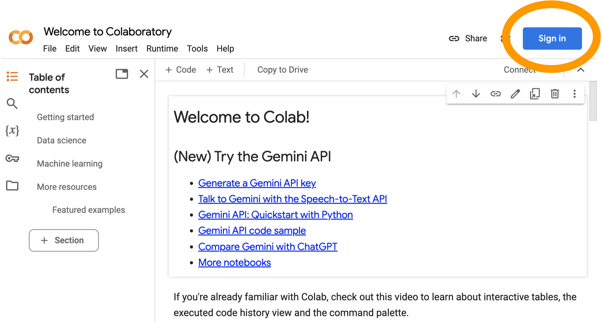
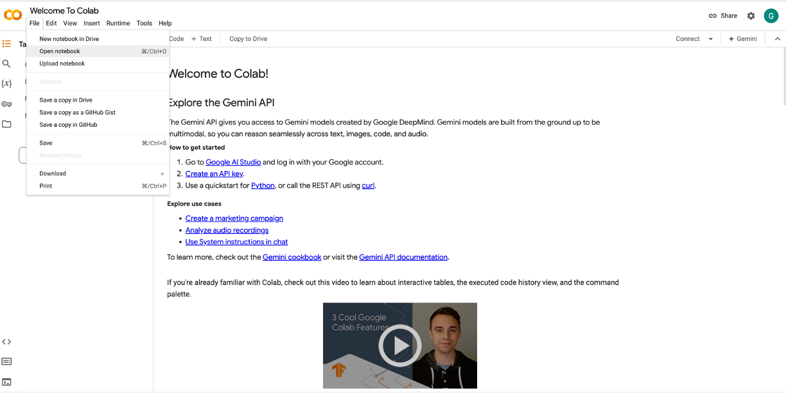
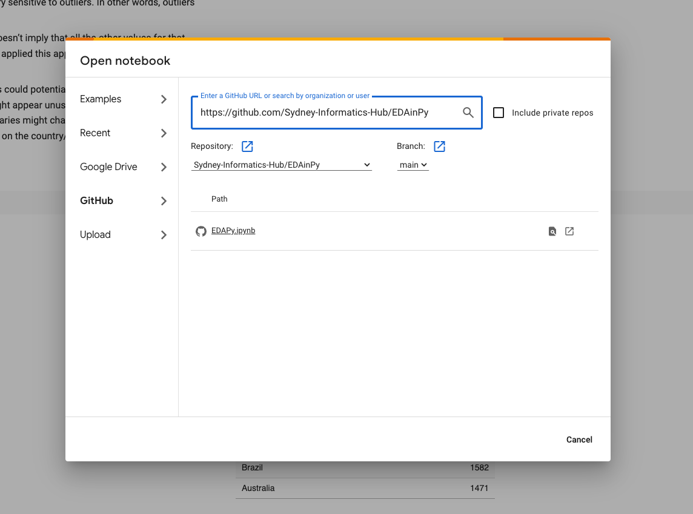

# Machine Learning in Python part 2: Classification
This is a repository for Sydney Informatics Hub's lesson materials for the "Introduction to Machine Learning using Python" workshops.

## Setup requirements

In this workshop we’re using Google Colab to modify and run Python code provided in a Jupyter notebook to illustrate the concepts of EDA. You will require a Google account to access Colab.

### How to access Colab and load the notebook

1.	Open a browser and navigate to https://colab.research.google.com/;

2.	Use the blue sign in button on the top right of the screen to sign into your Google account;

3.	If you are not automatically prompted to open a notebook, navigate to the **File** menu and then select **Open notebook**;

4.	Navigate to the ‘**GitHub**’ tab 

  - Paste this URL <https://github.com/Sydney-Informatics-Hub/lessons-mlpy-part2> into the box provided for GitHub URLs. 

  - Click the search symbol. Additional information about the repository and paths will appear.

  - In the Path section, click on `02-Classification-Exercises.ipynb` to open the notebook.

  

Note: if you get pop ups that prompt you to give GitHub permissions, close the popup window and untick the option ‘*include private repos*’.

5.	*[Optional but recommended]*. Save a copy of the notebook to your drive using the ‘Copy to Drive’ button. This is necessary if you want to save any changes you make to the code during the workshop.

## Code of Conduct

We expect all attendees of our training to follow our code of conduct, including bullying, harassment and discrimination prevention policies.

In order to foster a positive and professional learning environment we encourage the following kinds of behaviours at all our events and on our platforms:

* Use welcoming and inclusive language
* Be respectful of different viewpoints and experiences
* Gracefully accept constructive criticism
* Focus on what is best for the community
* Show courtesy and respect towards other community members

Our full CoC, with incident reporting guidelines, is available [here]https://sydney-informatics-hub.github.io/codeofconduct/).

[def]: fig/setup1.png
